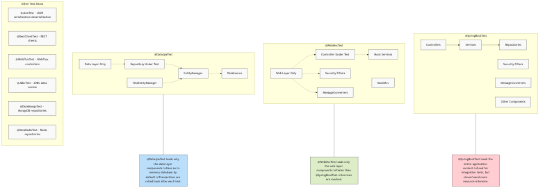
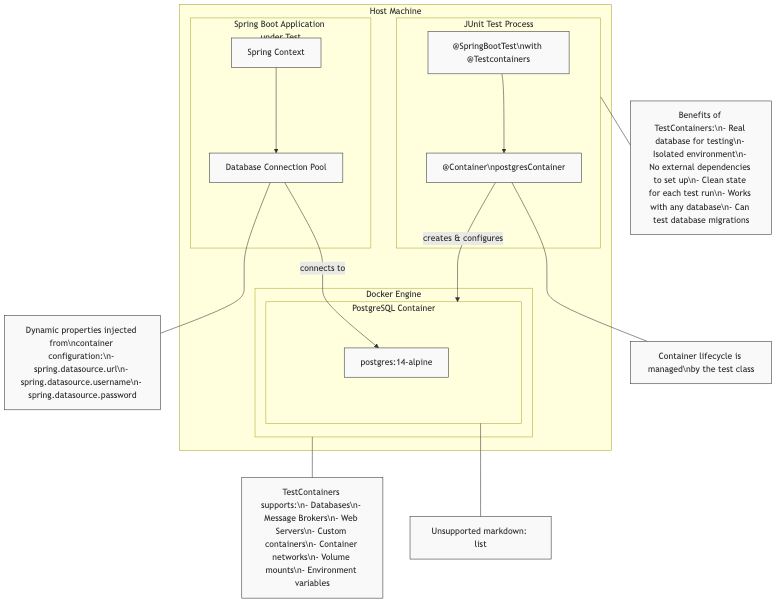

# Testing Spring Boot Applications Demystified Workshop

[](https://codespaces.new/PragmaTech-GmbH/testing-spring-boot-applications-demystified-workshop)

A one-day workshop to help developers become more confident and productive when implementing automated tests for Spring Boot applications.

## Workshop Overview

This workshop is designed to demystify testing in Spring Boot applications through hands-on exercises, covering everything from basic unit testing to advanced integration testing techniques. The workshop is divided into four lab sessions, each focusing on different aspects of testing Spring Boot applications.

## Workshop Format

- One-day workshop (approximately 6-7 hours of instruction)
- Four main slots, ranging from 70-110 minutes each
- Hands-on exercises with provided solutions
- Building on a consistent domain model (a library management system)

## GitHub Codespaces

This repository is configured for use with GitHub Codespaces, which provides a complete, ready-to-use development environment in the cloud. To use GitHub Codespaces:

1. Click on the "Code" button on the GitHub repository
2. Select the "Codespaces" tab
3. Click "Create codespace on main"
4. Wait for the codespace to start and setup to complete

The codespace includes:
- Java 21
- Maven
- Docker (for TestContainers)
- VS Code with Spring Boot extensions
- All diagrams rendered as images

For more information, see the [Codespaces documentation](.devcontainer/README.md).

## Workshop Slots

### Slot 1 (105 Minutes): Spring Boot Testing Fundamentals

- Introduction to the workshop
- Setting up development environment
- Spring Boot testing basics
- Unit testing with JUnit 5 and Mockito
- External collaborators and dependency injection for testability
- Creating custom JUnit 5 extensions
- Refactoring time-dependent code to improve testability
- Understanding Spring's testing pyramid

### Slot 2 (115 Minutes): Testing Spring MVC and Data JPA with Test Slices

- Introduction to sliced testing
- When unit testing is not sufficient
- Using @WebMvcTest for controller testing
- Testing filters and security configurations
- Using @DataJpaTest for repository testing
- Understanding JPA's transaction behavior and EntityManager
- Testing custom database queries, including native SQL queries

### Slot 3 (90 Minutes): Integration Testing with TestContainers

- Full application testing with @SpringBootTest
- Introduction to Testcontainers for external resources
- Data cleanup strategies for integration tests
- Understanding Spring test context caching
- Performance optimization in test suites
- Testing from outside with TestRestTemplate

### Slot 4 (70 Minutes): Advanced Testing Techniques and Best Practices

- Testing with WebClient and WebTestClient
- Mocking external services with WireMock
- Common Spring Boot testing pitfalls and how to avoid them
- Best practices for testing Spring Boot applications
- Testing asynchronous operations
- Using AI to help with testing
- Final thoughts and references

## Domain Model

The workshop uses a library management system as the sample domain. The domain model consists of books, library users, loans, and reviews.


## Lab Structure

Each lab (`lab-1` through `lab-4`) includes:

- Exercise files with instructions and TODO comments
- Solution files that show the complete implementation
- Supporting code and configurations

## Prerequisites

- Java 21 (or later)
- Maven 3.8+ (wrapper included)
- Docker (for Testcontainers in Lab 3)
- Your favorite IDE (IntelliJ IDEA, Eclipse, VS Code)

## Getting Started

1. Clone this repository:
   ```bash
   git clone https://github.com/yourusername/testing-spring-boot-applications-demystified.git
   ```

2. Import the projects into your IDE of choice.

3. Navigate to each lab directory and run:
   ```bash
   ./mvnw clean verify
   ```

## Lab 1: Spring Boot Testing Fundamentals

In this lab, you'll learn the basics of testing Spring Boot applications:

- Set up JUnit 5 tests for domain model classes
- Use Mockito to mock dependencies and test service classes
- Refactor time-dependent code to improve testability
- Create custom JUnit 5 extensions

Key files:
- [`Exercise1_BasicUnitTesting.java`](labs/lab-1/src/test/java/pragmatech/digital/workshops/lab1/exercises/Exercise1_BasicUnitTesting.java)
- [`Exercise2_MockitoBasics.java`](labs/lab-1/src/test/java/pragmatech/digital/workshops/lab1/exercises/Exercise2_MockitoBasics.java)
- [`Exercise3_RefactorTimeDependent.java`](labs/lab-1/src/test/java/pragmatech/digital/workshops/lab1/exercises/Exercise3_RefactorTimeDependent.java)
- [`Exercise4_JUnit5Extensions.java`](labs/lab-1/src/test/java/pragmatech/digital/workshops/lab1/exercises/Exercise4_JUnit5Extensions.java)

## Lab 2: Testing Spring MVC and Data JPA with Test Slices

In this lab, you'll learn how to use Spring Boot's test slices:



- Test Spring MVC controllers with @WebMvcTest
- Test security configurations
- Test repository classes with @DataJpaTest
- Understand JPA's transaction behavior

Key files:
- [`Exercise1_WebMvcTest.java`](labs/lab-2/src/test/java/pragmatech/digital/workshops/lab2/exercises/Exercise1_WebMvcTest.java)
- [`Exercise2_FilterSecurityTest.java`](labs/lab-2/src/test/java/pragmatech/digital/workshops/lab2/exercises/Exercise2_FilterSecurityTest.java)
- [`Exercise3_DataJpaTest.java`](labs/lab-2/src/test/java/pragmatech/digital/workshops/lab2/exercises/Exercise3_DataJpaTest.java)

## Lab 3: Integration Testing with TestContainers

In this lab, you'll learn how to use Testcontainers for integration testing:



You'll also learn about Spring test context caching:


- Set up full application tests with @SpringBootTest
- Configure and use Testcontainers for PostgreSQL
- Understand Spring test context caching and performance
- Test your application from the outside with TestRestTemplate

Key files:
- [`Exercise1_SpringBootTest.java`](labs/lab-3/src/test/java/pragmatech/digital/workshops/lab3/exercises/Exercise1_SpringBootTest.java)
- [`Exercise2_TestContextCaching.java`](labs/lab-3/src/test/java/pragmatech/digital/workshops/lab3/exercises/Exercise2_TestContextCaching.java)
- [`Exercise3_TestContainers.java`](labs/lab-3/src/test/java/pragmatech/digital/workshops/lab3/exercises/Exercise3_TestContainers.java)

## Lab 4: Advanced Testing Techniques and Best Practices

In this lab, you'll learn advanced testing techniques and best practices:


- Test reactive applications with WebTestClient
- Mock external services with WireMock
- Avoid common Spring Boot testing pitfalls
- Apply best practices for test organization and maintainability

Key files:
- [`Exercise1_WebClientTesting.java`](labs/lab-4/src/test/java/pragmatech/digital/workshops/lab4/exercises/Exercise1_WebClientTesting.java)
- [`Exercise2_CommonPitfalls.java`](labs/lab-4/src/test/java/pragmatech/digital/workshops/lab4/exercises/Exercise2_CommonPitfalls.java)
- [`Exercise3_BestPractices.java`](labs/lab-4/src/test/java/pragmatech/digital/workshops/lab4/exercises/Exercise3_BestPractices.java)

## Resources

- [Official Spring Boot Testing Documentation](https://docs.spring.io/spring-boot/docs/current/reference/html/features.html#features.testing)
- [JUnit 5 User Guide](https://junit.org/junit5/docs/current/user-guide/)
- [Mockito Documentation](https://javadoc.io/doc/org.mockito/mockito-core/latest/org/mockito/Mockito.html)
- [Testcontainers Documentation](https://www.testcontainers.org/)
- [WireMock Documentation](http://wiremock.org/docs/)

## License

This project is licensed under the MIT License - see the LICENSE file for details.
